# Ferra

Ferra is a visually appealing theme that is inspired by the vibrant colors of [Kanagawa](https://github.com/rebelot/kanagawa.nvim) and the warm tones of [Gruvbox](https://github.com/morhetz/gruvbox). This theme features a rich palette of earthy browns and greens, accented by subtle pops of blush, coral, and rose. The result is a harmonious blend of colors that is both inviting and easy on the eyes.

# Palette

<table>
	<tr>
		<th></th>
		<th>Name</th>
		<th>Hex</th>
	</tr>
	<tr>
		<td>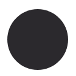</td>
		<td>Night</td>
		<td><code>#2b292d</code></td>
	</tr>
	<tr>
		<td>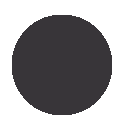</td>
		<td>Ash</td>
		<td><code>#383539</code></td>
	</tr>
	<tr>
		<td>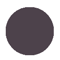</td>
		<td>Umber</td>
		<td><code>#4d424b</code></td>
	</tr>
	<tr>
		<td>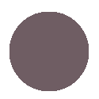</td>
		<td>Bark</td>
		<td><code>#6f5d63</code></td>
	</tr>
	<tr>
		<td>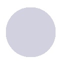</td>
		<td>Mist</td>
		<td><code>#d1d1e0</code></td>
	</tr>
	<tr>
		<td>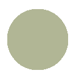</td>
		<td>Sage</td>
		<td><code>#b1b695</code></td>
	</tr>
	<tr>
		<td>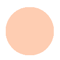</td>
		<td>Blush</td>
		<td><code>#fecdb2</code></td>
	</tr>
	<tr>
		<td>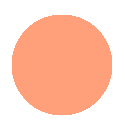</td>
		<td>Coral</td>
		<td><code>#ffa07a</code></td>
	</tr>
  	<tr>
		<td>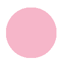</td>
		<td>Rose</td>
		<td><code>#f6b6c9</code></td>
	</tr>
  </tr>
  	<tr>
		<td>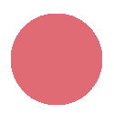</td>
		<td>Ember</td>
		<td><code>#e06b75</code></td>
	</tr>
  </tr>
  	<tr>
		<td>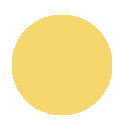</td>
		<td>Honey</td>
		<td><code>#f5d76e</code></td>
	</tr>
</table>

# Ports
- [Helix](https://github.com/casperstorm/ferra/tree/main/ports/helix)
- [WezTerm](https://github.com/casperstorm/ferra/tree/main/ports/wezterm)
- [Cryptowatch](https://github.com/casperstorm/ferra/tree/main/ports/cryptowatch)
- [Alacritty](./ports/alacritty)
- [Firefox](./ports/firefox)
- [Zed](./ports/zed)

# License
Ferra is released under the [MIT License](https://github.com/casperstorm/ferra/raw/main/LICENSE.md).
